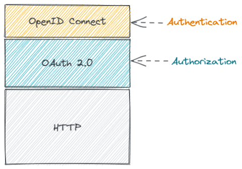
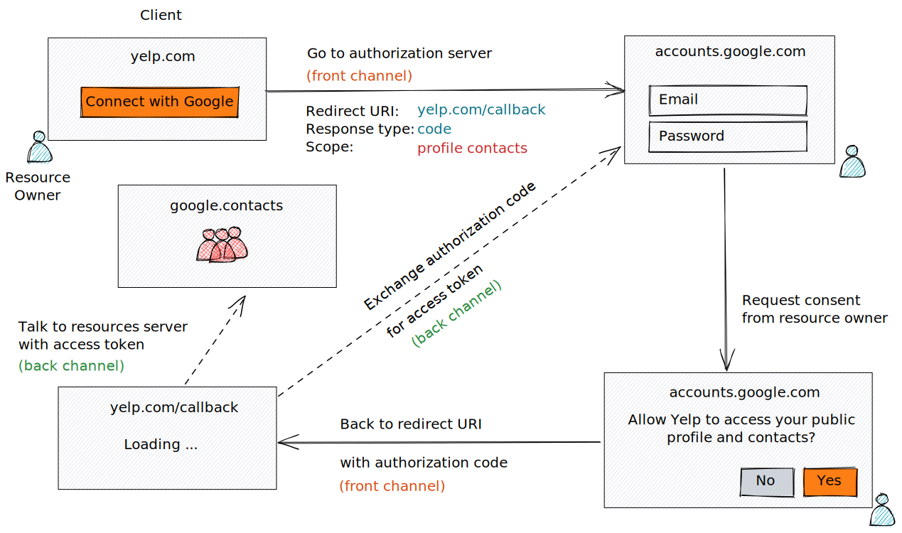
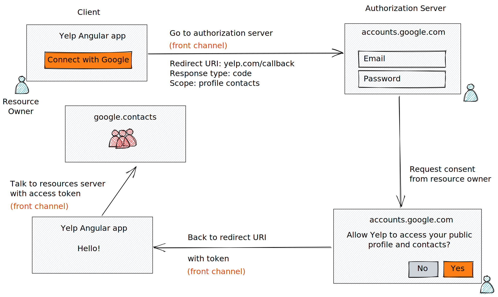
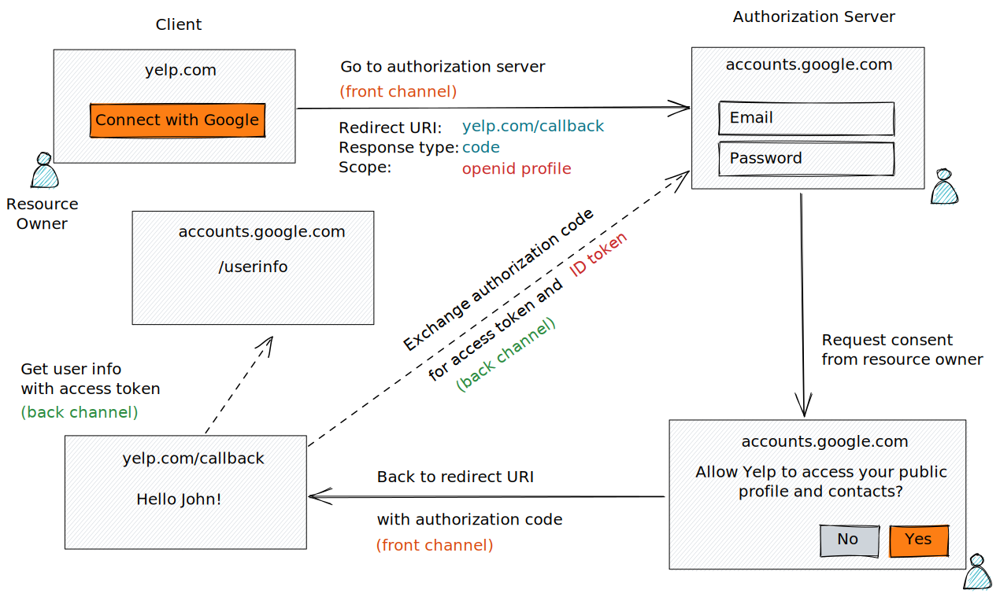

# Learn OAuth 2.0 and OpenID Connect

**OAuth 2.0** is a protocol designed for authorization.

**OpenID Connect** is a protocol designed for authentication.



## Identity use cases (pre-2010)

- Simple login (forms and cookies)
- Single sign-on across sites (SAML)
- Mobile app login (???)
- Delegated authorization (???)

## Identity use cases (pre-2014)

- Simple login (OAuth 2.0)
- Single sign-on accross sites (OAuth 2.0)
- Mobile app login (OAuth 2.0)
- Delegeated authorization (OAuth 2.0)

## OAuth 2.0 authorization code flow



## OAuth 2.0 terminology

- Resource owner
  - The user who is requesting access to a resource

- Client
  - ex. Yelp

- Authorization server
  - The system that is used to say: "Yes, I want this to happen"
  - ex. accounts.google.com

- Resource server
  - The API or the system that the client wants to get access to
  - ex. google.contacts API, through which Yelp can pull the contacts

- Authorization grant
  - The authorization given by the user: "Yes, I allow you to do that"

- Redirect URI
  - Where to go to after getting the autorization

- Access token
  - The key to access the resource server

- Back channel (highly secure channel)
  - ex: API Server to API Server

- Front channel (less secure channel)
  - ex: Requests from the browser

## Example of OAuth 2.0

- Starting the flow

  ```js
  https://accounts.google.com/o/oauth2/v2/auth?
    client_id=abc123&
    redirect_uri=https://yelp.com/callback&
    scope=profile&
    response_type=code&
    state=foobar
  ```

- Calling back
  - If the user says: "No"

      ```js
      https://yelp.com/callback?
        error=access_denied&
        error_description=The user did not consent.
      ```

  - If the user says: "Yes"

      ```js
      https://yelp.com/callback?
        code=wXjw1w0Pd411PWQXZnSg&
        state=foobar
      ```

- Exchange code for an access token

  ```js
  POST www.googleapis.com/oauth2/v4/token
  Content-Type: application/x-www-form-urlencoded

  code=wXjw1w0Pd411PWQXZnSg&
  client_id=abc123&
  client_secret=xyz456&
  grant_type=authorization_code
  ```

- Authorization server returns an access token
  
  ```json
  {
    "access_token": "fFAGRNJru1FTz70BzhT3Zg",
    "expires_in": 3920,
    "token_type": "Bearer",
  }
  ```

## OAuth 2.0 flows

- Authorization code (front channel + back channel)

- Implicit (front channel only)
  

- Resource owner password credentials (back channel only)

- Client credentials (back channel only)

## Problems with OAuth 2.0 for authentication

- No standard way to get the user's information
- Every implementation is a litlle different
- No common set of scopes

## OpenID Connect

OpenID Connect is a little piece you have to add on top of OAuth to get propper authentication.

### What OpenID Connects adds

- ID token
- UserInfo endpoint for getting more user information
- Standard set of scopes
- Standardized implementation

### OpenID Connect authorization code flow



## Tools

OAuth debugger

## References

## Credits

Material is gather from the following sources:

- [OAuth 2.0 and OpenID Connect (in plain English)](https://www.youtube.com/watch?v=996OiexHze0)
